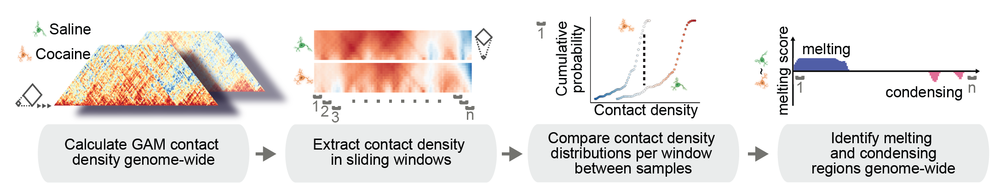

# MELTRONIC 

_a statistical framework to detect chromatin melting and condensation genome wide from GAM data_

[](https://doi.org/10.5281/zenodo.10528545)



### System requirements
Developed and tested with R version 3.6.0 Planting of a Tree.   
Please refer to the [R project website](https://cran.r-project.org/doc/manuals/r-release/R-admin.html) for installation and basic usage examples. Typical installation time on a desktop computer is ~15 minutes.
```r
library(data.table)
library(dplyr)
library(argparser)
library(stringr)
```
Software was developed and tested using data.table package version 1.12.0, dplyr package version 0.7.8, argparser package version 0.7.1 and stringr package version 1.4.1.
No non-standard hardware is required for execution of the scripts.

### Available command line applications:
- matrix_wide_to_long.R:   
    Converts a square matrix into a long matrix for IS calculation. Accepts wildcards for processing of multiple chromosomes. 
- long_matrix_to_IS.R:   
    Calculates insulation scores at multiple distances (default 100kb - 1Mb, steps of 100kb).
- MELTRONIC.R:   
   Compares insulation score (IS) distributions over regions of interest. Was applied to 120 kb sliding windows accross the entire genome and and long genes for the preparation of the manuscript.    

Expected output files can be found in the /data folder.   
Matrix conversion, IS calculation and MELTRONIC score calculation for the entire mouse genome takes about two hours on a standard desktop computer. 
    
type
```bash
Rscript command_line_apps/matrix_wide_to_long.R --help 
```
for explanations

### Available Snakefiles:
- Snakefile_wide_to_melt_long_genes:   
   Example Snakefile for calculation of melting scores of long protein coding genes (> 200 kb). Includes reshaping of square NPMI matrices to long NPMI matrices, ultra-fast calculation of insulation scores using 10 square sizes, and calculation of melting scores.
- Snakefile_wide_to_MELTRONIC:   
   Example Snakefile for calculation of melting scores in 120 kb sliding windows across the entire mouse genome (autosomes + chrX):. Includes reshaping of square NPMI matrices to long NPMI matrices, ultra-fast calculation of insulation scores using 10 square sizes, and calculation of melting scores.

Snakemake workflow manager was used to ensure reproducibility of analyses, but is not required for melting score calculations.   
Please refer to the [Snakemake website](https://snakemake.readthedocs.io/en/stable/) for installation and basic usage explanations.   
Please adjust file paths etc before executing the snakefiles. 
   
Developed and maintained by Dominik Szabó [](https://orcid.org/0000-0001-8109-5088).  
Please get in touch for questions and issues: dominik.szabo at mdc-berlin.de  
